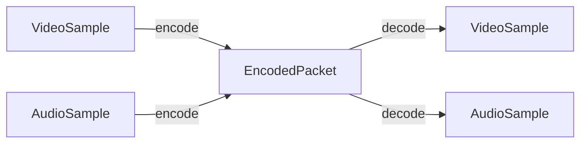

# Packets & samples

## Introduction

Media data in Mediabunny is present in two different forms:

- **Packet:** Encoded media data, the result of an encoding process
- **Sample:** Raw, uncompressed, presentable media data

In addition to data, both packets and samples carry additional metadata, such as timestamp, duration, width, etc.

Packets are represented with the `EncodedPacket` class, which is used for both video and audio packets. Samples are represented with the `VideoSample` and `AudioSample` classes:
- `VideoSample`: Represents a single frame of video.
- `AudioSample`: Represents a (typically short) section of audio.

Samples can be encoded into packets, and packets can be decoded into samples:


### Connection to WebCodecs

Packets and samples in Mediabunny correspond directly with concepts of the [WebCodecs API](https://w3c.github.io/webcodecs/):
- `EncodedPacket`\
	-> `EncodedVideoChunk` for video packets\
	-> `EncodedAudioChunk` for audio packets
- `VideoSample`
	-> `VideoFrame`
- `AudioSample`
	-> `AudioData`

Since Mediabunny makes heavy use of WebCodecs API, its own classes are typically used as wrappers around the WebCodecs classes. However, this wrapping comes with a few benefits:
1. **Independence:** This library remains functional even if the WebCodecs API isn't available. Encoders and decoders can be polyfilled using [custom coders](./supported-formats-and-codecs#custom-coders), and the library can run in non-browser contexts such as Node.js.
1. **Extensibility:** The wrappers serve as a namespace for additional operations, such as `toAudioBuffer()` on `AudioSample`, or `draw()` on `VideoSample`.
1. **Consistency:** While WebCodecs uses integer microsecond timestamps, Mediabunny uses floating-point second timestamps everywhere. With these wrappers, all timing information is always in seconds and the user doesn't need to think about unit conversions.

Conversion is easy:
```ts
import { EncodedPacket, VideoSample, AudioSample } from 'mediabunny';

// EncodedPacket to WebCodecs chunks:
encodedPacket.toEncodedVideoChunk(); // => EncodedVideoChunk
encodedPacket.toEncodedAudioChunk(); // => EncodedAudioChunk
// WebCodecs chunks to EncodedPacket:
EncodedPacket.fromEncodedChunk(videoChunk); // => EncodedPacket
EncodedPacket.fromEncodedChunk(audioChunk); // => EncodedPacket

// VideoSample to VideoFrame:
videoSample.toVideoFrame(); // => VideoFrame
// VideoFrame to VideoSample:
new VideoSample(videoFrame); // => VideoSample

// AudioSample to AudioData:
audioSample.toAudioData(); // => AudioData
// AudioData to AudioSample:
new AudioSample(audioData); // => AudioSample
```

::: info
`VideoSample`/`AudioSample` instances created from their WebCodecs API counterpart are very efficient; they simply maintain a reference to the underlying WebCodecs API instance and do not perform any unnecessary copying.
:::

### Negative timestamps

While packet and sample durations cannot be negative, packet and sample timestamps can.

A negative timestamp represents a sample that starts playing before the composition does (the composition always starts at 0). Negative timestamps are typically a result of a track being trimmed at the start, either to cut off a piece of media or to synchronize it with the other tracks. Therefore, you should avoid presenting any sample with a negative timestamp.

## `EncodedPacket`

An encoded packet represents encoded media data of any type (video or audio). They are the result of an *encoding process*, and you can turn encoded packets into actual media data using a *decoding process*.

### Creating packets

To create an `EncodedPacket`, you can use its constructor:
```ts
constructor(
    data: Uint8Array,
    type: 'key' | 'delta',
    timestamp: number, // in seconds
    duration: number, // in seconds
    sequenceNumber?: number,
    byteLength?: number,
);
```

::: info
You probably won't ever need to set `sequenceNumber` or `byteLength` in the constructor.
:::

For example, here we're creating a packet from some encoded video data:
```ts
import { EncodedPacket } from 'mediabunny';

const encodedVideoData = new Uint8Array([...]);
const encodedPacket = new EncodedPacket(encodedVideoData, 'key', 5, 1/24);
```

Alternatively, if you're coming from WebCodecs encoded chunks, you can create an `EncodedPacket` from them:
```ts
import { EncodedPacket } from 'mediabunny';

// From EncodedVideoChunk:
const encodedPacket = EncodedPacket.fromEncodedChunk(encodedVideoChunk);

// From EncodedAudioChunk:
const encodedPacket = EncodedPacket.fromEncodedChunk(encodedAudioChunk);
```

### Inspecting packets

Encoded packets have a bunch of read-only data you can inspect. You can get the encoded data like so:
```ts
encodedPacket.data; // => Uint8Array
```

You can query the type of packet:
```ts
encodedPacket.type; // => PacketType ('key' | 'delta')
```
- A *key packet* can be decoded directly, independently of other packets.
- A *delta packet* can only be decoded after the packet before it has been decoded.

For example, in a video track, it is common to have a key frame about every few seconds. When seeking, if the user seeks to a position shortly after a key frame, the decoded data can be shown quickly; if they seek far away from a key frame, the decoder must first crunch through many delta frames before it can show anything.

#### Determining a packet's actual type

The `type` field is derived from metadata in the containing file, which can sometimes (in rare cases) be incorrect. To determine a packet's actual type with certainty, you can do this:
```ts
// `packet` must come from the InputTrack `track`
const type = await track.determinePacketType(packet); // => PacketType | null
```

This determines the packet's type by looking into its bitstream. `null` is returned when the type couldn't be determined.

---

You can query the packet's timing information:
```ts
encodedPacket.timestamp; // => Presentation timestamp in seconds
encodedPacket.duration; // => Duration in seconds

// There also exist integer microsecond versions of these:
encodedPacket.microsecondTimestamp;
encodedPacket.microsecondDuration;
```

`timestamp` and `duration` are both given as floating-point numbers.

::: warning
Timestamps can be [negative](#negative-timestamps).
:::

---

A packet also has a quantity known as a *sequence number*:
```ts
encodedPacket.sequenceNumber; // => number
```

When [reading packets from an input file](./media-sinks#encodedpacketsink), this number specifies the relative ordering of packets. If packet $A$ has a lower sequence number than packet $B$, then packet $A$ comes first (in [decode order](./media-sinks#decode-vs-presentation-order)). If two packets have the same sequence number, then they represent the same media sample.

Sequence numbers have no meaning on their own and only make sense when comparing them to other sequence numbers. If a packet has sequence number $n$, it does not mean that it is the $n$th packet of the track.

Negative sequence numbers mean the packet's ordering is undefined. When creating an `EncodedPacket`, the sequence number defaults to -1.

### Cloning packets

Use the `clone` method to create a new packet from an existing packet. While doing so, you can change its timestamp and duration.
```ts
// Creates a clone identical to the original:
packet.clone();

// Creates a clone with the timestamp set to 10 seconds:
packet.clone({ timestamp: 10 });
```

### Metadata-only packets

[`EncodedPacketSink`](./media-sinks#encodedpacketsink) can create *metadata-only* packets:
```ts
await sink.getFirstPacket({ metadataOnly: true });
```

Metadata-only packets contain all the metadata of the full packet, but do not contain any data:
```ts
packet.data; // => Uint8Array([])
```

You can still retrieve the *size* that the data would have:
```ts
packet.byteLength; // => number
```

Given a packet, you can check if it is metadata-only like so:
```ts
packet.isMetadataOnly; // => boolean
```

## `VideoSample`

A video sample represents a single frame of video. It can be created directly from an image source, or be the result of a decoding process. Its API is modeled after [VideoFrame](https://developer.mozilla.org/en-US/docs/Web/API/VideoFrame).

### Creating video samples

Video samples have an image source constructor and a raw constructor.

::: info
The constructor of `VideoSample` is very similar to [`VideoFrame`'s constructor](https://developer.mozilla.org/en-US/docs/Web/API/VideoFrame/VideoFrame), but uses second timestamps instead of microsecond timestamps.
:::

#### Image source constructor

This constructor creates a `VideoSample` from a `CanvasImageSource`:

```ts
import { VideoSample } from 'mediabunny';

// Creates a sample from a canvas element
const sample = new VideoSample(canvas, {
	timestamp: 3, // in seconds
	duration: 1/24, // in seconds
});

// Creates a sample from an image element, with some added rotation
const sample = new VideoSample(imageElement, {
	timestamp: 5, // in seconds
	rotation: 90, // in degrees clockwise
});

// Creates a sample from a VideoFrame (timestamp will be copied)
const sample = new VideoSample(videoFrame);
```

#### Raw constructor

This constructor creates a `VideoSample` from raw pixel data given in an `ArrayBuffer`:

```ts
import { VideoSample } from 'mediabunny';

// Creates a sample from pixel data in the RGBX format
const sample = new VideoSample(buffer, {
	format: 'RGBX',
	codedWidth: 1280,
	codedHeight: 720,
	timestamp: 0,
});

// Creates a sample from pixel data in the YUV 4:2:0 format
const sample = new VideoSample(buffer, {
	format: 'I420',
	codedWidth: 1280,
	codedHeight: 720,
	timestamp: 0,
});
```

See [`VideoPixelFormat`](https://w3c.github.io/webcodecs/#enumdef-videopixelformat) for a list of pixel formats supported by WebCodecs.

### Inspecting video samples

A `VideoSample` has several read-only properties:
```ts
// The internal pixel format in which the frame is stored
videoSample.format; // => VideoPixelFormat | null

// Raw dimensions of the sample
videoSample.codedWidth; // => number
videoSample.codedHeight; // => number

// Transformed display dimensions of the sample (after rotation)
videoSample.displayWidth; // => number	
videoSample.displayHeight; // => number	

// Rotation of the sample in degrees clockwise. The raw sample should be
// rotated by this amount when it is presented.
videoSample.rotation; // => 0 | 90 | 180 | 270

// Timing information
videoSample.timestamp; // => Presentation timestamp in seconds
videoSample.duration; // => Duration in seconds
videoSample.microsecondTimestamp; // => Presentation timestamp in microseconds
videoSample.microsecondDuration; // => Duration in microseconds

// Color space of the sample
videoSample.colorSpace; // => VideoColorSpace
```

While all of these properties are read-only, you can use the `setTimestamp`, `setDuration` and `setRotation` methods to modify some of the metadata of the video sample.

::: warning
Timestamps can be [negative](#negative-timestamps).
:::

### Using video samples

Video samples provide a couple of ways with which you can access its frame data.

You can convert a video sample to a WebCodecs [`VideoFrame`](https://developer.mozilla.org/en-US/docs/Web/API/VideoFrame) to access additional data or to pass it to a [`VideoEncoder`](https://developer.mozilla.org/en-US/docs/Web/API/VideoEncoder):
```ts
videoSample.toVideoFrame(); // => VideoFrame
```
This method is virtually free if the video sample was constructed using a `VideoFrame`.

::: warning
The `VideoFrame` returned by this method **must** be closed separately from the video sample.
:::

---

It's also common to draw video samples to a `<canvas>` element or an `OffscreenCanvas`. For this, you can use the following methods:
```ts
draw(
	context: CanvasRenderingContext2D | OffscreenCanvasRenderingContext2D,
	dx: number,
	dy: number,
	dWidth?: number, // defaults to displayWidth
	dHeight?: number, // defaults to displayHeight
): void;

draw(
	context: CanvasRenderingContext2D | OffscreenCanvasRenderingContext2D,
	sx: number,
	sy: number,
	sWidth: number,
	sHeight: number,
	dx: number,
	dy: number,
	dWidth?: number, // defaults to sWidth
	dHeight?: number, // defaults to sHeight
): void;
```
These methods behave like [drawImage](https://developer.mozilla.org/en-US/docs/Web/API/CanvasRenderingContext2D/drawImage) and paint the video frame at the given position with the given dimensions. This method will automatically draw the frame with the correct rotation based on its `rotation` property.

The `drawWithFit` method can be used to draw the video sample to fill an entire canvas with a specified fitting algorithm:
```ts
drawWithFit(
	context: CanvasRenderingContext2D | OffscreenCanvasRenderingContext2D,
	options: {
		fit: 'fill' | 'contain' | 'cover';
		rotation?: Rotation; // Overrides the sample's rotation
		crop?: CropRectangle;
	},
): void;
```

If you want to draw the raw underlying image to a canvas directly (without respecting the rotation metadata), then you can use the following method:
```ts
videoSample.toCanvasImageSource(); // => VideoFrame | OffscreenCanvas;
```

This method returns a valid `CanvasImageSource` you can use with [drawImage](https://developer.mozilla.org/en-US/docs/Web/API/CanvasRenderingContext2D/drawImage).

::: warning
If this method returns a `VideoFrame`, you should use that frame immediately. This is because any internally-created video frames will automatically be closed in the next microtask.
:::

---

Sometimes you may want direct access to the underlying pixel data. To do this, `VideoSample` allows you to copy this data into an `ArrayBuffer`.

Use `allocationSize` to determine how many bytes are needed:
```ts
const bytesNeeded = videoSample.allocationSize(); // => number
```

Then, use `copyTo` to copy the pixel data into the destination buffer:
```ts
const bytes = new Uint8Array(bytesNeeded);
videoSample.copyTo(bytes);
```

::: info
The data will always be in the pixel format specified in the `format` field.

To convert the data into a different pixel format, or to extract only a section of the frame, please use the [`allocationSize`](https://developer.mozilla.org/en-US/docs/Web/API/VideoFrame/allocationSize) and [`copyTo`](https://developer.mozilla.org/en-US/docs/Web/API/VideoFrame/copyTo) methods on `VideoFrame` instead. Get a `VideoFrame` by running `videoSample.toVideoFrame()`.
:::

---

You can also clone a `VideoSample`:
```ts
const clonedSample = videoSample.clone(); // => VideoSample
```

The cloned sample **must** be closed separately from the original sample.

### Closing video samples

You must manually close a `VideoSample` after you've used it to free internally-held resources. Do this by calling the `close` method:
```ts
videoSample.close();
```

Try to close a `VideoSample` as soon as you don't need it anymore. Unclosed video samples can lead to high VRAM usage and decoder stalls.

After a `VideoSample` has been closed, its data becomes unavailable and most of its methods will throw an error.

## `AudioSample`

An audio sample represents a section of audio data. It can be created directly from raw audio data, or be the result of a decoding process. Its API is modeled after [AudioData](https://developer.mozilla.org/en-US/docs/Web/API/AudioData).

### Creating audio samples

Audio samples can be constructed either from an `AudioData` instance, an initialization object, or an `AudioBuffer`:

```ts
import { AudioSample } from 'mediabunny';

// From AudioData:
const sample = new AudioSample(audioData);

// From raw data:
const sample = new AudioSample({
    data: new Float32Array([...]),
    format: 'f32-planar', // Audio sample format
    numberOfChannels: 2,
    sampleRate: 44100, // in Hz
    timestamp: 0, // in seconds
});

// From AudioBuffer:
const timestamp = 0; // in seconds
const samples = AudioSample.fromAudioBuffer(audioBuffer, timestamp);
// => Returns multiple AudioSamples if the AudioBuffer is very long
```

The following audio sample formats are supported:
- `'u8'`: 8-bit unsigned integer (interleaved)
- `'u8-planar'`: 8-bit unsigned integer (planar)
- `'s16'`: 16-bit signed integer (interleaved)
- `'s16-planar'`: 16-bit signed integer (planar)
- `'s32'`: 32-bit signed integer (interleaved)
- `'s32-planar'`: 32-bit signed integer (planar)
- `'f32'`: 32-bit floating point (interleaved)
- `'f32-planar'`: 32-bit floating point (planar)

Planar formats store each channel's data contiguously, while interleaved formats store the channels' data interleaved together:


### Inspecting audio samples

An `AudioSample` has several read-only properties:
```ts
type AudioSampleFormat = 'u8' | 'u8-planar' | 's16' | 's16-planar' | 's32' | 's32-planar' | 'f32' | 'f32-planar';

audioSample.format; // => AudioSampleFormat
audioSample.sampleRate; // => Sample rate in Hz
audioSample.numberOfFrames; // => Number of frames per channel
audioSample.numberOfChannels; // => Number of channels
audioSample.timestamp; // => Presentation timestamp in seconds
audioSample.duration; // => Duration in seconds (= numberOfFrames / sampleRate)

// There also exist integer microsecond versions of timing info:
audioSample.microsecondTimestamp;
audioSample.microsecondDuration;
```

While all of these properties are read-only, you can use the `setTimestamp` method to modify the timestamp of the audio sample.

::: warning
Timestamps can be [negative](#negative-timestamps).
:::

### Using audio samples

Audio samples provide a couple of ways with which you can access its audio data.

You can convert an audio sample to a WebCodecs [`AudioData`](https://developer.mozilla.org/en-US/docs/Web/API/AudioData) to pass it to an [`AudioEncoder`](https://developer.mozilla.org/en-US/docs/Web/API/AudioEncoder):
```ts
audioSample.toAudioData(); // => AudioData
```
This method is virtually free if the audio sample was constructed using an `AudioData`, as long as its timestamp wasn't modified using `setTimestamp`.

::: warning
The `AudioData` returned by this method **must** be closed separately from the audio sample.
:::

You can also easily convert the audio sample into an [`AudioBuffer`](https://developer.mozilla.org/en-US/docs/Web/API/AudioBuffer) for use with the Web Audio API:
```ts
audioSample.toAudioBuffer(); // => AudioBuffer
```

---

You can also directly copy raw audio data from an `AudioSample` into an `ArrayBuffer`. For this, the `allocationSize` and `copyTo` methods can be used.

The copying process is controlled by the following configuration object: 
```ts
type AudioSampleCopyToOptions = {
	planeIndex: number;
	format?: AudioSampleFormat;
	frameOffset?: number;
	frameCount?: number;
};
```
- `planeIndex` *(required)*\
	The index identifying the plane to copy from. This must be 0 if using a non-planar (interleaved) output format.
- `format`\
	The output format for the destination data. Defaults to the `AudioSample`'s format.
- `frameOffset`\
	An offset into the source plane data indicating which frame to begin copying from. Defaults to 0.	
- `frameCount`\
	The number of frames to copy. If not provided, the copy will include all frames in the plane beginning with `frameOffset`.

Because the meaning of `planeIndex` depends on which format is being used for extraction, it's best to always explicitly specify a format.

For example, here we're extracting the entire audio data as `f32`:
```ts
const options = { planeIndex: 0, format: 'f32' };
const bytesNeeded = audioSample.allocationSize(options);
const data = new Float32Array(bytesNeeded / 4);
audioSample.copyTo(data, options);
```

Here, we're iterating over each plane in the `s16` format:
```ts
// The size of the first plane is the size of all planes
const bytesNeeded = audioSample.allocationSize({
	planeIndex: 0,
	format: 's16-planar',
});
const data = new Int16Array(bytesNeeded / 2);

for (let i = 0; i < audioSample.numberOfChannels; i++) {
	audioSample.copyTo(data, { planeIndex: i, format: 's16-planar' });
	// Do something with the data
}
```

::: info
The behavior of `allocationSize` and `copyTo` exactly mirrors that of the WebCodecs API. However, the WebCodecs API specification only mandates support for converting to `f32-planar`, while Mediabunny's implementation supports conversion into all formats. Therefore, Mediabunny's methods are more powerful.
:::

### Closing audio samples

You must manually close an `AudioSample` after you've used it to free internally-held resources. Do this by calling the `close` method:
```ts
audioSample.close();
```

Try to close an `AudioSample` as soon as you don't need it anymore. Unclosed audio samples can lead to high memory usage and decoder stalls.

After an `AudioSample` has been closed, its data becomes unavailable and most of its methods will throw an error.