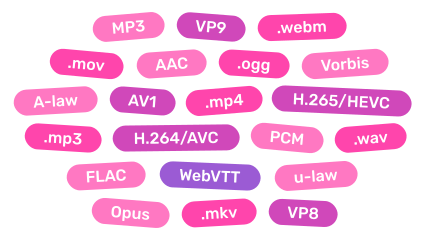

---
# https://vitepress.dev/reference/default-theme-home-page
layout: home

title: Mediabunny

hero:
    name: Mediabunny
    text: Complete media toolkit
    tagline: A JavaScript library for reading, writing, and converting media files. Directly in the browser, and faster than anybunny else.
    image: 
      src: /mediabunny-logo.svg
      alt: Mediabunny logo
    actions:
    - theme: brand
      text: Hop in
      link: /guide/introduction
    - theme: alt
      text: Examples
      link: /examples
---

<div class="space-y-16 mt-8">
<div class="grid grid-cols-2 gap-20 items-center">
<div>
<h1 class="inline-block" style="background: -webkit-linear-gradient(-30deg, #ff45ac, #ff78c2); -webkit-background-clip: text; color: transparent;">Read any media file, efficiently</h1>
<p class="text-lg">Mediabunny allows you efficiently read data from any media file, no matter the size: duration, resolution, rotation, tracks, codecs and other metadata, as well as raw or decoded media data from anywhere in the file. Load only what you need.</p>
<a class="!no-underline inline-flex items-center gap-1.5" :no-icon="true" href="/guide/reading-media-files">
	Docs
	<span class="vpi-arrow-right" />
</a>
</div>
<div class="text-sm relative">

<div class="absolute size-70 rounded-full bg-[#ff45ac]/0 top-1/2 left-1/2 -translate-x-1/2 -translate-y-1/2 blur-[200px]" />

```ts
const input = new Input({
	source: new UrlSource('./bigbuckbunny.mp4'),
	formats: ALL_FORMATS, // .mp4, .webm, .wav, ...
});

const duration = await input.computeDuration();

const videoTrack = await input.getPrimaryVideoTrack();
const { displayWidth, displayHeight, rotation } = videoTrack;

const audioTrack = await input.getPrimaryAudioTrack();
const { sampleRate, channelCount } = audioTrack;

// Get the frame halfway through the video
const sink = new VideoSampleSink(videoTrack);
const { canvas } = await sink.getSample(duration / 2);

// Loop over all frames of the video
for await (const frame of sink.samples()) {
	// ...
}
```

</div>
</div>

<div class="grid grid-cols-2 gap-20 items-center">
<div class="text-sm relative">

<div class="absolute size-70 rounded-full bg-[#ff45ac]/0 top-1/2 left-1/2 -translate-x-1/2 -translate-y-1/2 blur-[200px]" />

```ts
const output = new Output({
	format: new Mp4OutputFormat(), // .mp4
	target: new BufferTarget(), // in memory
});

// Add video, driven by a canvas
const videoSource = new CanvasSource(canvas, {
	codec: 'av1',
	bitrate: QUALITY_HIGH,
});
output.addVideoTrack(videoSource);

// Add audio, driven by audio buffers
const audioSource = new AudioBufferSource({
	codec: 'opus',
	bitrate: QUALITY_HIGH,
});
output.addAudioTrack(audioSource);

await output.start();

// Add media data here...

await output.finalize;
const { buffer } = output.target; // Contains the final file
```

</div>
<div>
<h1 class="inline-block" style="background: -webkit-linear-gradient(-30deg, #ff45ac, #ff78c2); -webkit-background-clip: text; color: transparent;">Create new media files, programmatically</h1>
<p class="text-lg">Generate new media files (such as MP4 or WebM) directly on the client, and as fast as the hardware allows. Add multiple video, audio, or subtitle tracks, and have precise control down to the microsecond.</p>
<a class="!no-underline inline-flex items-center gap-1.5" :no-icon="true" href="/guide/writing-media-files">
	Docs
	<span class="vpi-arrow-right" />
</a>
</div>
</div>

<div class="grid grid-cols-2 gap-20 items-center">
<div>
<h1 class="inline-block" style="background: -webkit-linear-gradient(-30deg, #ff45ac, #ff78c2); -webkit-background-clip: text; color: transparent;">Hopping-fast file conversion</h1>
<p class="text-lg">Use the Conversion API to transform any media file into any other media file: perform transmuxing, transcoding, resizing, rotation, audio resampling, trimming, and more.</p>
<a class="!no-underline inline-flex items-center gap-1.5" :no-icon="true" href="/guide/converting-media-files">
	Docs
	<span class="vpi-arrow-right" />
</a>
</div>
<div class="text-sm relative">

<div class="absolute size-70 rounded-full bg-[#ff45ac]/0 top-1/2 left-1/2 -translate-x-1/2 -translate-y-1/2 blur-[200px]" />

```ts
const input = new Input({
	source: new BlobSource(file), // Read from disk
	formats: ALL_FORMATS,
});
const output = new Output({
	format: new WebMOutputFormat(), // Convert to .webm
	target: new StreamTarget(writableStream), // Write to disk
});

const conversion = await Conversion.init({ input, output });
await conversion.execute();

// Done!
```

</div>
</div>

<div class="grid grid-cols-2 gap-20 items-center">
<div class="relative">
<div class="absolute size-70 rounded-full bg-[#ff45ac]/0 top-1/2 left-1/2 -translate-x-1/2 -translate-y-1/2 blur-[200px]" />

</div>
<div>
<h1 class="inline-block" style="background: -webkit-linear-gradient(-30deg, #ff45ac, #ff78c2); -webkit-background-clip: text; color: transparent;">Universal I/O</h1>
<p class="text-lg">Read and write files from and to memory, disk, or the network. Create files for offline use, or live-stream them as they're being created. Inject media data from a canvas, webcam, screen, microphone, audio buffer, your own encoding stack, or whatever. It's all up to you.</p>
</div>
</div>

<div class="grid grid-cols-2 gap-20 items-center">
<div>
<h1 class="inline-block" style="background: -webkit-linear-gradient(-30deg, #ff45ac, #ff78c2); -webkit-background-clip: text; color: transparent;">Wide container & codec support</h1>
<p class="text-lg">Mediabunny supports many commonly used container formats and a wide variety of video and audio codecs. And all of them bidirectionally, too! (that means for reading and writing)</p>
<a class="!no-underline inline-flex items-center gap-1.5" :no-icon="true" href="/guide/supported-formats-and-codecs">
	See full list
	<span class="vpi-arrow-right" />
</a>
</div>
<div class="grid place-items-center relative">
<div class="absolute size-70 rounded-full bg-[#ff45ac]/0 top-1/2 left-1/2 -translate-x-1/2 -translate-y-1/2 blur-[200px]" />

</div>
</div>

<script setup>
const benchmarks = [
	{
		name: 'Extract metadata',
		unit: 'ops/s',
		results: [
			{ name: 'Mediabunny', value: 1000/1.16 },
			{ name: '@remotion/media-parser', value: 1000/4.28 },
			{ name: 'web-demuxer', value: 1000/12.4 },
			{ name: 'mp4box.js', value: 1000/23 },
			{ name: 'ffmpeg.wasm', value: 1000/547 },
		]
	},
	{
		name: 'Iterate over all video packets',
		unit: 'packets/s',
		results: [
			{ name: 'Mediabunny', value: 10800 },
			{ name: 'web-demuxer', value: 2390 },
			{ name: '@remotion/media-parser', value: 842 },
		]
	},
	{
		name: 'Convert to .webm & resize to 320x180',
		unit: 'frames/s',
		results: [
			{ name: 'Mediabunny', value: 804 },
			{ name: '@remotion/webcodecs', value: 324 },
			{ name: 'ffmpeg.wasm', value: 12 },
		]
	}
];

const bundleSizes = [
	{ name: 'Reading .wav files', size: 5.1 },
	{ name: 'Writing .wav files', size: 5.79 },
	{ name: 'Writing .webm files', size: 11.36 },
	{ name: 'Reading .webm files', size: 15.2 },
	{ name: 'Reading .mp4 files', size: 16.03 },
	{ name: 'Writing .mp4 files', size: 17.28 },
	{ name: 'Reading all formats', size: 30.02 },
	{ name: 'mp4box.js', size: 37.3, isThirdParty: true },
	{ name: 'web-demuxer', size: 44.8, isThirdParty: true },
	{ name: 'All features', size: 69.62 },
	{ name: '@remotion/webcodecs', size: 87.2 + 20.8, isThirdParty: true },
];
</script>

<div class="grid grid-cols-2 gap-20 items-center">
<div class="space-y-8">
	<div v-for="benchmark in benchmarks" class="space-y-2">
		<p class="text-center font-medium text-sm !mt-0 !mb-2">{{ benchmark.name }}</p>
		<div v-for="result, i in benchmark.results" class="flex items-center gap-2">
			<p :class="{ '!text-[#ff78c2]': i === 0 }" class="!my-0 shrink-0 font-medium w-40 text-xs whitespace-nowrap text-right">{{ result.name }}</p>
			<div class="h-8 bg-[var(--vp-c-gray-2)] rounded-md" :style="{ width: `calc(${result.value / Math.max(...benchmark.results.map(x => x.value))}*(100% - 7.5rem - 10rem))`, background: i === 0 ? '-webkit-linear-gradient(-30deg, #ff45ac, #ff78c2)' : undefined }" />
			<p :class="{ '!text-[#ff78c2]': i === 0, 'opacity-50': i > 0 }" class="!my-0 text-xs w-30">{{ result.value < 100 ? result.value.toPrecision(3) : Math.floor(result.value) }} {{ benchmark.unit }}</p>
		</div>
	</div>
	<p class="!my-0 text-center text-[10px] opacity-50 !leading-4">Reading BigBuckBunny1080pH264.mov (691 MiB) from disk<br>Ryzen 7600X, RTX 4070, NVMe SSD, measured 2025-06-22</p>
</div>
<div>
<h1 class="inline-block" style="background: -webkit-linear-gradient(-30deg, #ff45ac, #ff78c2); -webkit-background-clip: text; color: transparent;">High performance</h1>
<p class="text-lg">By reading only what you need, writing progressively, utilizing hardware-accelerated encoding and decoding via the WebCodecs API, and using a pipelined design, Mediabunny is able to get the job done fast.</p>
</div>
</div>

<div class="grid grid-cols-2 gap-20 items-center">
<div>
<h1 class="inline-block" style="background: -webkit-linear-gradient(-30deg, #ff45ac, #ff78c2); -webkit-background-clip: text; color: transparent;">Built from scratch, for the web</h1>
<p class="text-lg">Mediabunny is 100% implemented in TypeScript and has zero dependencies. Its API was designed to be highly tree-shakable, meaning you only include what you use.</p>
</div>
<div class="space-y-2">
	<p class="text-center font-medium text-sm !mt-0 !mb-2">Bundle size, minified + gzipped</p>
	<div v-for="result in bundleSizes" class="flex items-center gap-2">
		<p :class="{ '!text-[#ff78c2]': !result.isThirdParty }" class="!my-0 shrink-0 font-medium w-40 text-xs whitespace-nowrap text-right">{{ result.name }}</p>
		<div class="h-8 bg-[var(--vp-c-gray-2)] rounded-md" :style="{ width: `calc(${result.size / Math.max(...bundleSizes.map(x => x.size))}*(100% - 7.5rem - 10rem))`, background: !result.isThirdParty ? '-webkit-linear-gradient(-30deg, #ff45ac, #ff78c2)' : undefined }" />
		<p :class="{ '!text-[#ff78c2]': !result.isThirdParty, 'opacity-50': result.isThirdParty }" class="!my-0 text-xs w-30">{{ result.size < 100 ? result.size.toPrecision(3) : Math.floor(result.size) }} kB</p>
	</div>
	<div class="flex items-center gap-2">
		<p class="!my-0 shrink-0 font-medium w-40 text-xs whitespace-nowrap text-right">ffmpeg.wasm</p>
		<div class="relative h-8">
			<div class="h-full rounded-md absolute top-0 left-0 w-10000" style="background: linear-gradient(to right, var(--vp-c-gray-2) 0px, transparent 2000px, transparent 100%);" />
		</div>
	</div>
</div>
</div>

</div>
