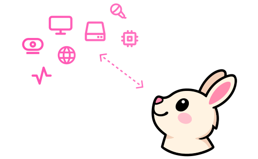
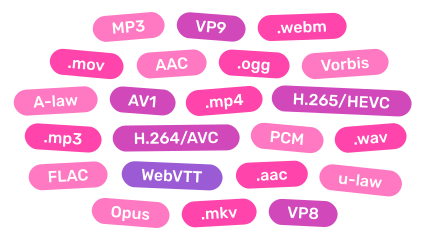

<script setup>
const quotes = [
	{
		quote: 'The missing part in the JS ecosystem for building web-first media apps.',
		author: 'Yonatan, Gling AI',
		image: '/avatars/yonatan.jpeg',
		url: 'https://x.com/yonatanbd',
	},
	{
		quote: 'Mediabunny gives you low-level control with high-level ease. It’s fast, lightweight, and finally feels like media processing built for the web, not ported to it.',
		author: 'Konstantin, Diffusion Studio',
		image: '/avatars/konstantin.png',
		url: 'https://x.com/konstipaulus',
	}
];

const benchmarks = [
	{
		name: 'Extract metadata',
		unit: 'ops/s',
		results: [
			{ name: 'Mediabunny', value: 1000/1.16 },
			{ name: '@remotion/media-parser', value: 1000/4.28 },
			{ name: 'web-demuxer', value: 1000/12.4 },
			{ name: 'mp4box.js', value: 1000/23 },
			{ name: 'ffmpeg.wasm', value: 1000/547 },
		]
	},
	{
		name: 'Iterate over all video packets',
		unit: 'packets/s',
		results: [
			{ name: 'Mediabunny', value: 10800 },
			{ name: 'web-demuxer', value: 2390 },
			{ name: '@remotion/media-parser', value: 842 },
		]
	},
	{
		name: 'Convert to .webm & resize to 320x180',
		unit: 'frames/s',
		results: [
			{ name: 'Mediabunny', value: 804 },
			{ name: '@remotion/webcodecs', value: 324 },
			{ name: 'ffmpeg.wasm', value: 12 },
		]
	}
];

const bundleSizes = [
	{ name: 'Reading .wav files', size: 5.1 },
	{ name: 'Writing .wav files', size: 5.79 },
	{ name: 'Writing .webm files', size: 11.36 },
	{ name: 'Reading .webm files', size: 15.2 },
	{ name: 'Reading .mp4 files', size: 16.03 },
	{ name: 'Writing .mp4 files', size: 17.28 },
	{ name: 'Reading all formats', size: 30.02 },
	{ name: 'mp4box.js', size: 37.3, isThirdParty: true },
	{ name: 'All features', size: 69.62 },
	{ name: '@remotion/webcodecs', size: 87.2 + 20.8, isThirdParty: true },
];

const sponsors = {
	gold: [
		{ image: '/sponsors/remotion.png', name: 'Remotion', url: 'https://remotion.dev/' },
		{ image: '/sponsors/gling.svg', name: 'Gling AI', url: 'https://www.gling.ai/' },
		{ image: '/sponsors/diffusionstudio.png', name: 'Diffusion Studio', url: 'https://diffusion.studio/' },
		{ image: '/sponsors/kino.jpg', name: 'Kino', url: 'https://kino.ai/' },
	],
	silver: [
		{ image: '/sponsors/pintura-labs.png', name: 'Pintura Labs', url: 'https://pqina.nl/pintura/' },
	],
	bronze: [
		{ image: '/sponsors/rve.svg', name: 'React Video Editor', url: 'https://www.reactvideoeditor.com/' },
		{ image: '/sponsors/mux.jpg', name: 'Mux', url: 'https://www.mux.com/' },
	],
	individual: [
		{ image: 'https://avatars.githubusercontent.com/u/84167135', name: 'Memenome', url: 'https://github.com/memenome' },
		{ image: 'https://avatars.githubusercontent.com/u/5913254', name: 'Brandon McConnell', url: 'https://github.com/brandonmcconnell' },
		{ image: 'https://avatars.githubusercontent.com/u/9549394', name: 'studnitz', url: 'https://github.com/studnitz' },
		{ image: 'https://avatars.githubusercontent.com/u/504909', name: 'Hirbod', url: 'https://github.com/hirbod' },
		{ image: 'https://avatars.githubusercontent.com/u/2698271', name: 'Matthew Gardner', url: 'https://github.com/spheric' },
		{ image: 'https://avatars.githubusercontent.com/u/30229596', name: 'Pablo Bonilla', url: 'https://github.com/devPablo' },
		{ image: 'https://avatars.githubusercontent.com/u/38181164', name: 'wcw', url: 'https://github.com/asd55667' },
		{ image: 'https://avatars.githubusercontent.com/u/1836701', name: 'Bean Deng', url: 'https://github.com/HADB' },
		{ image: 'https://avatars.githubusercontent.com/u/63088713', name: 'taf2000', url: 'https://github.com/taf2000' },
		{ image: 'https://avatars.githubusercontent.com/u/58149663', name: 'H7GhosT', url: 'https://github.com/H7GhosT' },
		{ image: 'https://avatars.githubusercontent.com/u/91711202', name: 'ihasq', url: 'https://github.com/ihasq' },
		{ image: 'https://avatars.githubusercontent.com/u/61233224', name: 'Allwhy', url: 'https://github.com/Allwhy' },
		{ image: 'https://avatars.githubusercontent.com/u/97225946', name: '808vita', url: 'https://github.com/808vita' },
		{ image: 'https://avatars.githubusercontent.com/u/3709646', name: 'Rodrigo Belfiore', url: 'https://github.com/roprgm' },
		{ image: 'https://avatars.githubusercontent.com/u/31102694', name: 'Aiden Liu', url: 'https://github.com/aidenlx' },
	],
};
</script>

<div class="flex gap-6 flex-wrap justify-center items-center">
	<div v-for="quote in quotes" class="bg-(--vp-c-bg-soft) w-80 p-4 rounded-2xl flex shrink-0 flex-col relative">
		<svg class="size-8 absolute -top-3 left-2.5 text-(--vp-c-gray-1)" xmlns="http://www.w3.org/2000/svg" width="16" height="16" viewBox="0 0 16 16"><path fill="currentColor" d="M12 12a1 1 0 0 0 1-1V8.558a1 1 0 0 0-1-1h-1.388q0-.527.062-1.054q.093-.558.31-.992t.559-.683q.34-.279.868-.279V3q-.868 0-1.52.372a3.3 3.3 0 0 0-1.085.992a4.9 4.9 0 0 0-.62 1.458A7.7 7.7 0 0 0 9 7.558V11a1 1 0 0 0 1 1zm-6 0a1 1 0 0 0 1-1V8.558a1 1 0 0 0-1-1H4.612q0-.527.062-1.054q.094-.558.31-.992q.217-.434.559-.683q.34-.279.868-.279V3q-.868 0-1.52.372a3.3 3.3 0 0 0-1.085.992a4.9 4.9 0 0 0-.62 1.458A7.7 7.7 0 0 0 3 7.558V11a1 1 0 0 0 1 1z"/></svg>
		<p class="!my-0 flex-1 text-sm !leading-6">{{ quote.quote }}</p>
		<div class="shrink-0 flex gap-2 items-center mt-1.5">
			<a :href="quote.url" target="_blank">
				
			</a>
			<p class="!my-0 flex-1 text-xs font-medium">{{ quote.author }}</p>
		</div>
	</div>
</div>

<div class="mx-auto w-full max-w-92 text-xl mt-20">

```bash
npm install mediabunny
```

</div>

<div class="space-y-16 mt-18">
<div class="flex flex-col lg:flex-row lg:gap-20 lg:items-center">
<div class="flex-1 min-w-0">
<h1 class="inline-block" style="background: -webkit-linear-gradient(-30deg, #ff45ac, #ff78c2); -webkit-background-clip: text; color: transparent;">Read any media file, efficiently</h1>
<p class="text-lg">Mediabunny allows you efficiently read data from any video or audio file, no matter the size: duration, resolution, rotation, tracks, codecs and other metadata, as well as raw or decoded media data from anywhere in the file. Load only what you need.</p>
<a class="!no-underline inline-flex items-center gap-1.5" :no-icon="true" href="/guide/reading-media-files">
	Docs
	<span class="vpi-arrow-right" />
</a>
</div>
<div class="text-sm relative flex-1 min-w-0">

<div class="absolute size-70 rounded-full bg-[#ff45ac]/0 top-1/2 left-1/2 -translate-x-1/2 -translate-y-1/2 blur-[200px]" />

```ts
const input = new Input({
	source: new UrlSource('./bigbuckbunny.mp4'),
	formats: ALL_FORMATS, // .mp4, .webm, .wav, ...
});

const duration = await input.computeDuration();

const videoTrack = await input.getPrimaryVideoTrack();
const { displayWidth, displayHeight, rotation } = videoTrack;

const audioTrack = await input.getPrimaryAudioTrack();
const { sampleRate, numberOfChannels } = audioTrack;

// Get the frame halfway through the video
const sink = new VideoSampleSink(videoTrack);
const frame = await sink.getSample(duration / 2);

// Loop over all frames of the video
for await (const frame of sink.samples()) {
	// ...
}
```

</div>
</div>

<div class="flex flex-col-reverse lg:flex-row lg:gap-20 lg:items-center">
<div class="text-sm relative flex-1 min-w-0">

<div class="absolute size-70 rounded-full bg-[#ff45ac]/0 top-1/2 left-1/2 -translate-x-1/2 -translate-y-1/2 blur-[200px]" />

```ts
const output = new Output({
	format: new Mp4OutputFormat(), // .mp4
	target: new BufferTarget(), // in memory
});

// Add video, driven by a canvas
const videoSource = new CanvasSource(canvas, {
	codec: 'av1',
	bitrate: QUALITY_HIGH,
});
output.addVideoTrack(videoSource);

// Add audio, driven by audio buffers
const audioSource = new AudioBufferSource({
	codec: 'opus',
	bitrate: QUALITY_HIGH,
});
output.addAudioTrack(audioSource);

await output.start();

// Add media data here...

await output.finalize();
const { buffer } = output.target; // Contains the final file
```

</div>
<div class="flex-1 min-w-0">
<h1 class="inline-block" style="background: -webkit-linear-gradient(-30deg, #ff45ac, #ff78c2); -webkit-background-clip: text; color: transparent;">Create new media files, programmatically</h1>
<p class="text-lg">Generate new media files (such as MP4 or WebM) directly on the client, and as fast as the hardware allows. Add multiple video, audio, or subtitle tracks, and have precise control down to the microsecond.</p>
<a class="!no-underline inline-flex items-center gap-1.5" :no-icon="true" href="/guide/writing-media-files">
	Docs
	<span class="vpi-arrow-right" />
</a>
</div>
</div>

<div class="flex flex-col lg:flex-row lg:gap-20 lg:items-center">
<div class="flex-1 min-w-0">
<h1 class="inline-block" style="background: -webkit-linear-gradient(-30deg, #ff45ac, #ff78c2); -webkit-background-clip: text; color: transparent;">Hopping-fast file conversion</h1>
<p class="text-lg">Use the Conversion API to transform any media file into any other media file: perform transmuxing, transcoding, resizing, rotation, audio resampling, trimming, and more.</p>
<a class="!no-underline inline-flex items-center gap-1.5" :no-icon="true" href="/guide/converting-media-files">
	Docs
	<span class="vpi-arrow-right" />
</a>
</div>
<div class="text-sm relative flex-1 min-w-0">

<div class="absolute size-70 rounded-full bg-[#ff45ac]/0 top-1/2 left-1/2 -translate-x-1/2 -translate-y-1/2 blur-[200px]" />

```ts
const input = new Input({
	source: new BlobSource(file), // Read from disk
	formats: ALL_FORMATS,
});
const output = new Output({
	format: new WebMOutputFormat(), // Convert to .webm
	target: new StreamTarget(writableStream), // Write to disk
});

const conversion = await Conversion.init({ input, output });
await conversion.execute();

// Done!
```

</div>
</div>

<div class="flex flex-col-reverse lg:flex-row gap-4 lg:gap-20 items-center">
<div class="relative flex-1 min-w-0">
<div class="absolute size-70 rounded-full bg-[#ff45ac]/0 top-1/2 left-1/2 -translate-x-1/2 -translate-y-1/2 blur-[200px]" />

</div>
<div class="flex-1 min-w-0">
<h1 class="inline-block" style="background: -webkit-linear-gradient(-30deg, #ff45ac, #ff78c2); -webkit-background-clip: text; color: transparent;">Universal I/O</h1>
<p class="text-lg">Read and write files from and to memory, disk, or the network. Create files for offline use, or live-stream them as they're being created. Inject media data from a canvas, webcam, screen, microphone, audio buffer, your own encoding stack, or whatever. It's all up to you.</p>
</div>
</div>

<div class="flex flex-col lg:flex-row gap-4 lg:gap-20 lg:items-center">
<div class="flex-1 min-w-0">
<h1 class="inline-block" style="background: -webkit-linear-gradient(-30deg, #ff45ac, #ff78c2); -webkit-background-clip: text; color: transparent;">Wide container & codec support</h1>
<p class="text-lg">Mediabunny supports many commonly used container formats and a wide variety of video and audio codecs. And all of them bidirectionally, too! (that means for reading and writing)</p>
<a class="!no-underline inline-flex items-center gap-1.5" :no-icon="true" href="/guide/supported-formats-and-codecs">
	See full list
	<span class="vpi-arrow-right" />
</a>
</div>
<div class="grid place-items-center relative flex-1 min-w-0">
<div class="absolute size-70 rounded-full bg-[#ff45ac]/0 top-1/2 left-1/2 -translate-x-1/2 -translate-y-1/2 blur-[200px]" />

</div>
</div>

<div class="flex flex-col-reverse lg:flex-row gap-4 lg:gap-20 lg:items-center">
<div class="space-y-8 flex-1 min-w-0">
	<div v-for="benchmark in benchmarks" class="space-y-2">
		<p class="text-center font-medium text-sm !mt-0 !mb-2">{{ benchmark.name }}</p>
		<div v-for="result, i in benchmark.results" class="flex items-center gap-2">
			<p :class="{ '!text-[#ff78c2]': i === 0 }" class="!my-0 shrink-0 font-medium w-40 text-xs whitespace-nowrap text-right">{{ result.name }}</p>
			<div class="h-8 bg-(--vp-c-gray-2) rounded-md" :style="{ width: `calc(${result.value / Math.max(...benchmark.results.map(x => x.value))}*(100% - 7.5rem - 10rem))`, background: i === 0 ? '-webkit-linear-gradient(-30deg, #ff45ac, #ff78c2)' : undefined }" />
			<p :class="{ '!text-[#ff78c2]': i === 0, 'opacity-50': i > 0 }" class="!my-0 text-xs w-30">{{ result.value < 100 ? result.value.toPrecision(3) : Math.floor(result.value) }} {{ benchmark.unit }}</p>
		</div>
	</div>
	<p class="!my-0 text-center text-[10px] opacity-50 !leading-4">Reading BigBuckBunny1080pH264.mov (691 MiB) from disk<br>Ryzen 7600X, RTX 4070, NVMe SSD, measured 2025-06-22</p>
</div>
<div class="flex-1 min-w-0">
<h1 class="inline-block" style="background: -webkit-linear-gradient(-30deg, #ff45ac, #ff78c2); -webkit-background-clip: text; color: transparent;">High performance</h1>
<p class="text-lg">By reading only what you need, writing progressively, utilizing hardware-accelerated encoding and decoding via the WebCodecs API, and using a pipelined design, Mediabunny is able to get the job done fast.</p>
</div>
</div>

<div class="flex flex-col lg:flex-row gap-4 lg:gap-20 lg:items-center">
<div class="flex-1 min-w-0">
<h1 class="inline-block" style="background: -webkit-linear-gradient(-30deg, #ff45ac, #ff78c2); -webkit-background-clip: text; color: transparent;">Built from scratch, for the web</h1>
<p class="text-lg">Mediabunny is 100% implemented in TypeScript and has zero dependencies. Its API was designed to be highly tree-shakable, meaning you only include what you use.</p>
</div>
<div class="space-y-2 flex-1 min-w-0">
	<p class="text-center font-medium text-sm !mt-0 !mb-2">Bundle size, minified + gzipped</p>
	<div v-for="result in bundleSizes" class="flex items-center gap-2">
		<p :class="{ '!text-[#ff78c2]': !result.isThirdParty }" class="!my-0 shrink-0 font-medium w-40 text-xs whitespace-nowrap text-right">{{ result.name }}</p>
		<div class="h-8 bg-(--vp-c-gray-2) rounded-md" :style="{ width: `calc(${result.size / Math.max(...bundleSizes.map(x => x.size))}*(100% - 7.5rem - 10rem))`, background: !result.isThirdParty ? '-webkit-linear-gradient(-30deg, #ff45ac, #ff78c2)' : undefined }" />
		<p :class="{ '!text-[#ff78c2]': !result.isThirdParty, 'opacity-50': result.isThirdParty }" class="!my-0 text-xs w-30">{{ result.size < 100 ? result.size.toPrecision(3) : Math.floor(result.size) }} kB</p>
	</div>
	<div class="flex items-center gap-2">
		<p class="!my-0 shrink-0 font-medium w-40 text-xs whitespace-nowrap text-right">ffmpeg.wasm</p>
		<div class="relative h-8">
			<div class="h-full rounded-md absolute top-0 left-0 w-10000" style="background: linear-gradient(to right, var(--vp-c-gray-2) 0px, transparent 2000px, transparent 100%);" />
		</div>
	</div>
	<p class="!mt-2 !mb-0 text-center text-[10px] opacity-50 !leading-4">Measured 2025-06-22</p>
</div>
</div>

<div class="flex flex-col items-center">
	<h2 class="!my-0 !pt-0 !border-0">...and more!</h2>
	<a class="!no-underline inline-flex items-center gap-1.5" :no-icon="true" href="/guide/introduction#features">
		See full feature list
		<span class="vpi-arrow-right" />
	</a>
</div>

</div>

<hr class="!my-16" />

<div class="flex flex-col items-center">
	<h1 id="sponsors" class="flex items-center gap-4" style="background: -webkit-linear-gradient(-30deg, #ff45ac, #ff78c2); -webkit-background-clip: text; color: transparent;">
		Made possible by you
		
	</h1>
	<p class="max-w-2xl">Mediabunny is an open-source project released under the <a href="https://choosealicense.com/licenses/mpl-2.0/" target="_blank">MPL-2.0</a> and is therefore free to use for any purpose, including closed-source commercial use. A permissive license is essential for a foundational library like this to truly thrive. That said, this project requires an immense amount of work and care. This is made possible by the generous financial backing of these awesome sponsors:</p>
	<template v-if="sponsors.gold.length > 0">
		<h3 class="!text-3xl">Gold sponsors</h3>
		<div class="flex flex-wrap mt-1 justify-center gap-1">
			<a v-for="sponsor in sponsors.gold" :href="sponsor.url" target="_blank" rel="sponsored" class="flex items-center p-2 rounded-full hover:bg-(--vp-c-gray-3) !text-(--vp-c-text-1) !no-underline">
				
				<p class="!my-0 !font-medium px-3 text-lg">{{ sponsor.name }}</p>
			</a>
		</div>
	</template>
	<template v-if="sponsors.silver.length > 0">
		<h3 class="!text-2xl">Silver sponsors</h3>
		<div class="flex flex-wrap mt-1 justify-center gap-1">
			<a v-for="sponsor in sponsors.silver" :href="sponsor.url" target="_blank" rel="sponsored" class="flex items-center p-2 rounded-full hover:bg-(--vp-c-gray-3) !text-(--vp-c-text-1) !no-underline">
				
				<p class="!my-0 !font-medium px-3">{{ sponsor.name }}</p>
			</a>
		</div>
	</template>
	<template v-if="sponsors.bronze.length > 0">
		<h3 class="!text-xl">Bronze sponsors</h3>
		<div class="flex flex-wrap mt-1 justify-center gap-1">
			<a v-for="sponsor in sponsors.bronze" :href="sponsor.url" target="_blank" rel="sponsored" class="flex items-center p-2 rounded-full hover:bg-(--vp-c-gray-3) !text-(--vp-c-text-1) !no-underline">
				
				<p class="!my-0 !font-medium px-3 text-sm">{{ sponsor.name }}</p>
			</a>
		</div>
	</template>
	<template v-if="sponsors.individual.length > 0">
		<h4 class="!text-base">Individual sponsors</h4>
		<div class="flex flex-wrap mt-1 justify-center">
			<a v-for="sponsor in sponsors.individual" :href="sponsor.url" target="_blank" rel="sponsored" class="flex gap-1 w-24 flex-col items-center p-2 rounded-xl hover:bg-(--vp-c-gray-3) !text-(--vp-c-text-1) !no-underline">
				
				<p class="!my-0 !font-medium text-xs !leading-4 text-center">{{ sponsor.name }}</p>
			</a>
		</div>
	</template>
	<a href="https://github.com/sponsors/Vanilagy" target="_blank" class="flex items-center pl-4 pr-5 mt-8 py-2 rounded-full bg-(--vp-c-brand-3) hover:bg-(--vp-c-brand-2) !text-white !no-underline">
		<svg class="size-6" xmlns="http://www.w3.org/2000/svg" width="24" height="24" viewBox="0 0 24 24"><rect width="24" height="24" fill="none"/><path fill="none" stroke="currentColor" stroke-linecap="round" stroke-linejoin="round" stroke-width="2" d="m12 21l-8.8-8.3A5.6 5.6 0 1 1 12 6a5.6 5.6 0 1 1 8.9 6.6z"/></svg>
		<p class="!my-0 !font-medium pl-3">And you</p>
	</a>
</div>